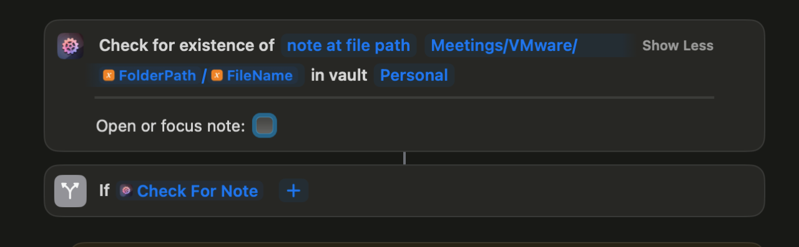

---
# zco-1201
title: "Checking for the existence of a missing note (from AFO) should not pop up an error toast"
status: completed
type: task
parent: auri-ujej
tags:
  - from-linear
created_at: 2025-05-07T14:11:55.620Z
updated_at: 2025-06-03T11:36:58.049Z
---

## Linear Metadata

- **Linear**: [ZCO-1201](https://linear.app/actionsdotwork/issue/ZCO-1201)
- **Project**: Actions URI
- **Milestone**: 1.8.1
- **Branch**: \`feature/zco-1201-checking-for-the-existence-of-a-missing-note-from-afo-should\`

---

From [https://secure.helpscout.net/conversation/2926508265/742?viewId=7423769](https://secure.helpscout.net/conversation/2926508265/742?viewId=7423769):  > I run a \`Check for existence of note\` action. It works as expected on the shortcut side, but I get an alert on the Obsidian vault (screenshot below). I know the note won't exist on first run, but just checking for its existence, an alert/popup is displayed, which is seen as an error.  **Idea:** Introduce some sort of `showToast` parameter which defaults to `true`, but if it's set to `false`, do not pop up any toasts.    

---

## Linked Commits
- [`c325ec6`](https://github.com/czottmann/Actions-For-Obsidian/commit/c325ec6dbf4fffd84a21a1e91288c4827f53ef47) — [NEW] Implements new ActionsURI "hide-ui-notice-on-error" parameter
- [`4a9edb9`](https://github.com/czottmann/obsidian-actions-uri/commit/4a9edb974aa1c5f8d8f4e0a6a822d2ed203999b0) — [NEW] Adds optional standard parameter "hide-ui-notice-on-error"
