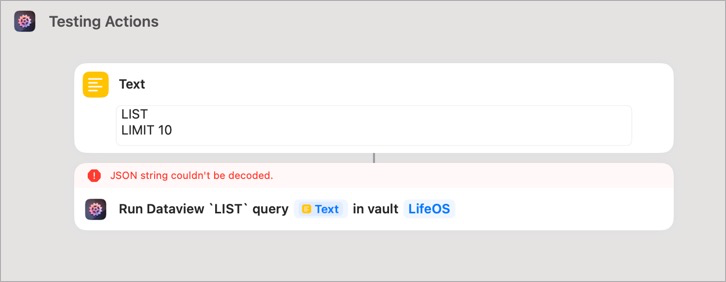

---
# zco-985
title: "DataView LIST results return unexpected nested array"
status: completed
type: bug
parent: auri-fzy4
tags:
  - from-linear
created_at: 2025-02-03T09:16:22.164Z
updated_at: 2025-02-04T12:31:40.378Z
---

## Linear Metadata

- **Linear**: [ZCO-985](https://linear.app/actionsdotwork/issue/ZCO-985)
- **Project**: Actions URI
- **Milestone**: 1.7.1
- **Branch**: \`feature/zco-985-dataview-list-results-return-unexpected-nested-array\`

---

Regression of / related to [ZCO-918](https://linear.app/actionsdotwork/issue/ZCO-918/make-dataview-list-result-consistent)  Reproducible error! Via [Help Scout #678](https://secure.helpscout.net/conversation/2837335579/678):  > For the past 2-3 days, I keep getting this error. Any idea what the issue might be? > >  > > \------ > > Actions For Obsidian 2024.2.3 (7402) > > macOS 15.3.0  The underlying issue is that in 1.7.0, I changed `LIST` results to be 2D string arrays when they are supposed to be 1D. The fix is to return 1D.

---

## Linked Commits
- [`92d90a8`](https://github.com/czottmann/obsidian-actions-uri/commit/92d90a8974e4c112e97462ff517ea2d1e9af650f) — [FIX] Fixes LIST return value issues
